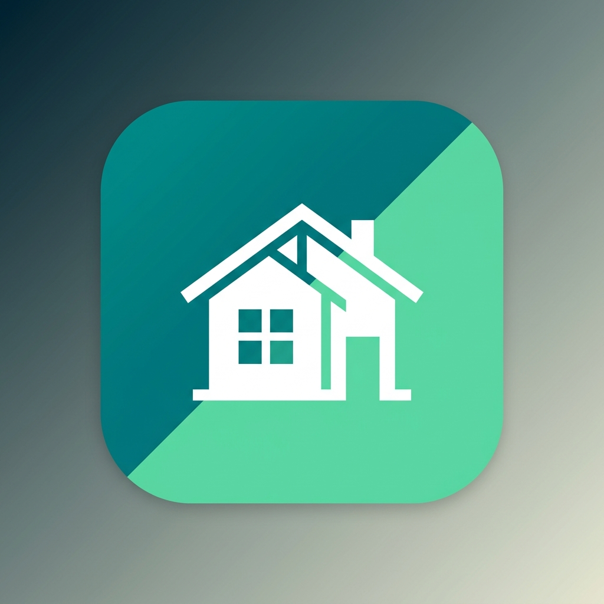
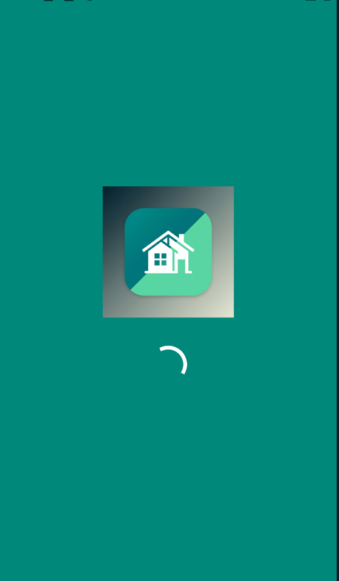
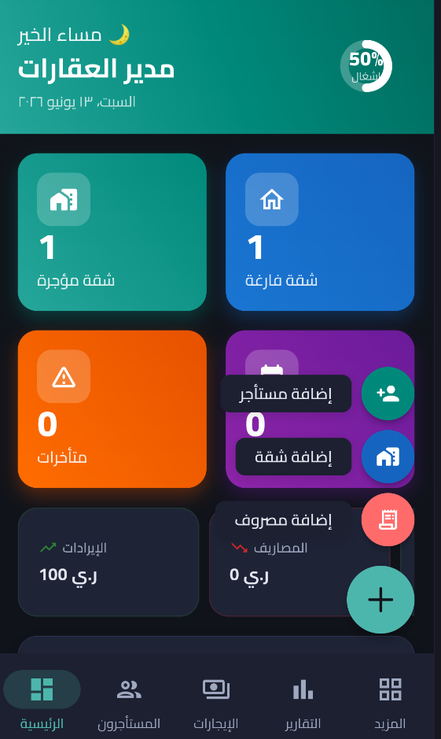
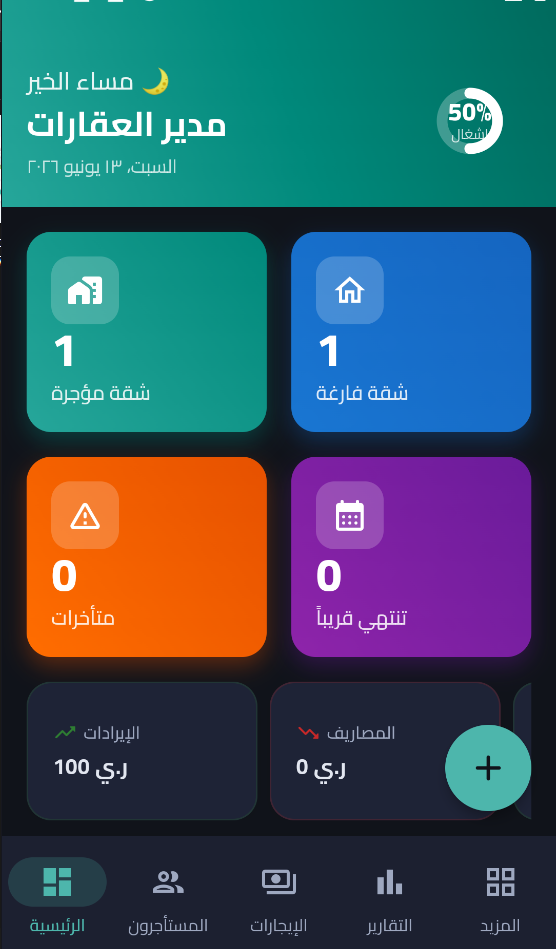
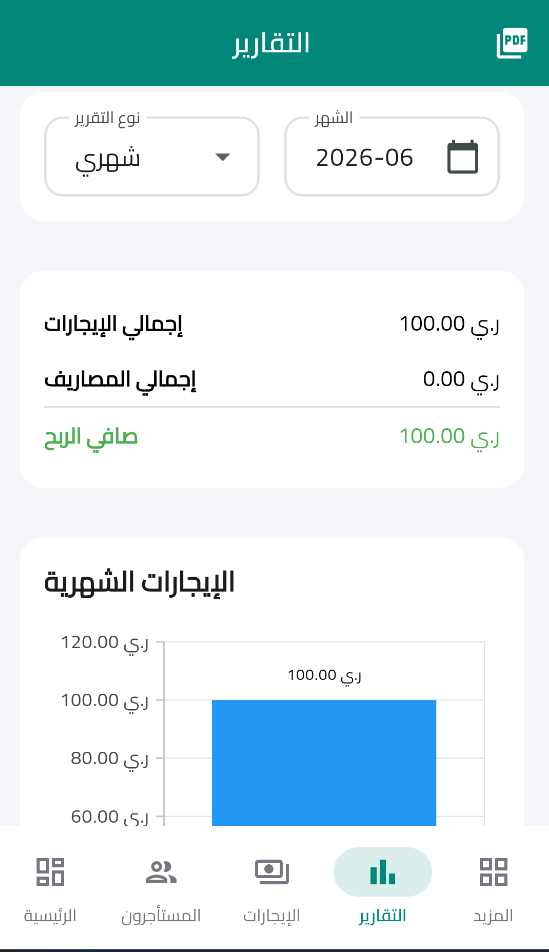
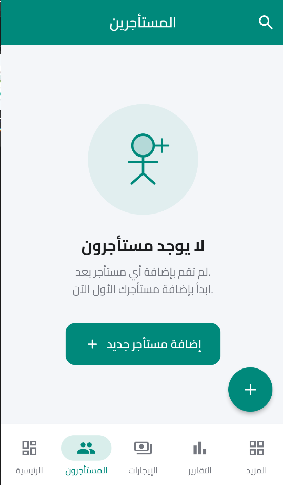
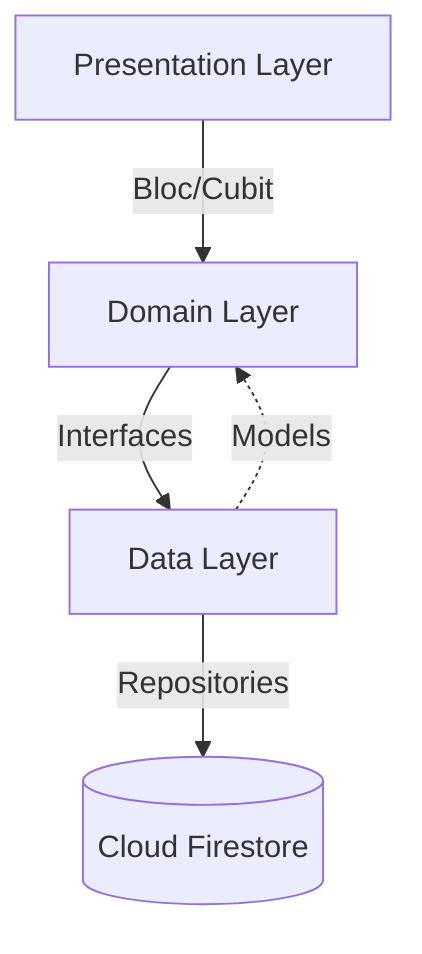

<div align="center">
  
  
  # Rento (رينتو) - نظام إدارة العقارات المتكامل 🏢

  **تطبيق حديث وسريع وموثوق مصمم خصيصاً لتسهيل إدارة العقارات، المستأجرين، العقود، والبيانات المالية للملاك ومدراء العقارات بكل احترافية وسهولة.**
  
  [](https://flutter.dev/)
  [](https://dart.dev/)
  [](https://bloclibrary.dev/)
  [](https://firebase.google.com/docs/firestore)
  [](https://firebase.google.com/docs/auth)
</div>

---

## 📌 نبذة عامة عن النظام
**Rento (رينتو)** هو الحل الأمثل للملاك ومسؤولي العقارات للتحول من الإدارة الورقية أو التقليدية إلى الإدارة الرقمية السحابية. يوفر التطبيق بيئة متكاملة تتيح لك متابعة حالة الشقق (فارغة أو مؤجرة)، إدارة بيانات المستأجرين، تتبع تواريخ العقود وإشعارات انتهائها، تسجيل الدفعات المالية وإيصالاتها، ومراقبة المصروفات التشغيلية. كل هذا مدعوم بنظام سحابي لحظي من (Firebase) مع دعم كامل للعمل دون اتصال بالإنترنت (Offline First).

## ✨ المميزات الرئيسية
- **لوحة تحكم تفاعلية (Dashboard):** عرض ملخصات مالية سريعة، نسب الإشغال، وتنبيهات فورية للعقود التي تقترب من الانتهاء.
- **إدارة ذكية للشقق:** تتبع حالة الشقق وتصنيفها حسب الأدوار، ومعرفة الشقق الفارغة والمؤجرة فوراً.
- **دورة حياة المستأجرين والعقود:** إضافة المستأجرين، ربطهم بالشقق، وتسجيل تفاصيل عقود الإيجار وتواريخها بدقة.
- **السجل المالي (المدفوعات والمصروفات):** تسجيل دفعات الإيجار ورفع صور الإيصالات، وتتبع المصروفات الدورية وأعمال الصيانة.
- **تنبيهات ذكية:** نظام تنبيهات ينبهك آلياً عند اقتراب موعد انتهاء عقد أي مستأجر.
- **دعم الوضع الداكن (Dark Mode):** تصميم عصري باستخدام (Material 3) يتكيف بالكامل مع الوضع الداكن لراحة العين.
- **مزامنة سحابية لحظية:** بياناتك محفوظة بأمان على خوادم Google، ويمكنك الوصول إليها من أي جهاز آخر.

## 📸 لقطات الشاشة
<div align="center">
  
  
  
  
  
</div>

## 🛠️ التقنيات المستخدمة
تم بناء النظام باستخدام أحدث التقنيات وأفضل الممارسات البرمجية:
- **إطار العمل (Framework):** Flutter & Dart.
- **إدارة الحالة (State Management):** `flutter_bloc` (Cubit).
- **قواعد البيانات (Database):** Cloud Firestore (NoSQL).
- **نظام المصادقة (Auth):** Firebase Authentication.
- **التخزين السحابي (Storage):** Firebase Storage (لحفظ صور الإيصالات والملفات الشخصية).
- **تصميم الواجهات (UI):** Material 3 Design مع استخدام خطوط (Cairo) لدعم مثالي للغة العربية.

## 🏗️ الهيكلية المعمارية (Architecture)
يتبع المشروع معمارية **الطبقات النظيفة (Clean Architecture)** لضمان قابلية التوسع والصيانة وسهولة تتبع الأخطاء:


- **طبقة العرض (Presentation):** تحتوي على واجهات المستخدم (UI) المكتوبة بـ Flutter.
- **طبقة النطاق (Domain):** تحتوي على منطق العمل (Business Logic) المدار باستخدام Cubits.
- **طبقة البيانات (Data):** تحتوي على النماذج (Models) ومستودعات البيانات (Repositories) التي تتخاطب مباشرة مع Firebase.

## 🗄️ بنية البيانات في Firestore
تم تصميم قاعدة البيانات (NoSQL) لتكون فعالة، حيث يملك كل مستخدم (مالك عقار) مساراً خاصاً به لضمان العزل والأمان:

* `users/{userId}`: بيانات المستخدم (المالك) وإعداداته.
* `users/{userId}/apartments/{apartmentId}`: بيانات الشقق الخاصة بهذا المالك.
* `users/{userId}/tenants/{tenantId}`: بيانات المستأجرين.
* `users/{userId}/contracts/{contractId}`: العقود المرتبطة بالمستأجرين والشقق.
* `users/{userId}/payments/{paymentId}`: الدفعات المالية المسددة.
* `users/{userId}/expenses/{expenseId}`: مصروفات الصيانة وغيرها.

## 🧩 شرح الوحدات الأساسية
1. **الشقق (Apartments):** الوحدة الأساسية. تتميز برقم الشقة، الدور، والحالة (مؤجرة أو فارغة). عند تأجير شقة، يتغير لونها وحالتها تلقائياً في النظام.
2. **المستأجرين (Tenants):** سجل شامل يحوي أسماء المستأجرين، أرقام هواتفهم، وتاريخ بدء ونهاية التأجير، ويتم ربط المستأجر برقم الشقة.
3. **العقود (Contracts):** لإدارة الوثائق القانونية والتواريخ. يوفر النظام طريقة لتحديد بداية العقد ونهايته لمعرفة متى يجب التجديد.
4. **المدفوعات (Payments):** نظام لتسجيل الإيجارات المستلمة، مع إمكانية تحديد الشهر، طريقة الدفع (كاش/تحويل)، وإرفاق صورة لسند القبض أو الحوالة.
5. **المصروفات (Expenses):** لتسجيل أي تكاليف تشغيلية مثل (صيانة المصعد، فواتير الكهرباء، تنظيف المبنى)، للمساعدة في حساب صافي الأرباح لاحقاً.
6. **التقارير (Reports):** نظرة تحليلية تجمع البيانات المالية لتقديم صورة واضحة لمدخول العقار ومصروفاته.
7. **التنبيهات (Alerts):** شاشة مخصصة تعمل كمساعد شخصي يعرض بطاقات تحذيرية للعقود التي أوشكت على الانتهاء لضمان عدم تفويت المواعيد.

## 📶 آلية العمل دون اتصال (Offline Support)
تطبيق **Rento** مصمم ليعمل في أسوأ ظروف الشبكة. بفضل تفعيل ميزة `Offline Persistence` في Firestore:
- يتم الاحتفاظ بنسخة محلية (Cache) من كافة بياناتك على الجهاز.
- يمكنك تصفح الشقق والمستأجرين وحتى إضافة دفعات جديدة والإنترنت مقطوع تماماً.
- بمجرد عودة الاتصال، يقوم التطبيق بمزامنة جميع التغييرات ورفعها إلى الخوادم السحابية تلقائياً وبدون أي تدخل منك.

## 🔐 نظام المصادقة Firebase Authentication
- تسجيل الدخول وإنشاء الحسابات مؤمن بالكامل عبر بريد إلكتروني وكلمة مرور.
- يدعم التطبيق ميزة التحقق من البريد الإلكتروني (Email Verification).
- يوفر شاشات جاهزة لاستعادة كلمة المرور المنسية (Password Reset).

## 🚀 خطوات تثبيت المشروع وتشغيله

### المتطلبات المسبقة
- تثبيت [Flutter SDK](https://flutter.dev/docs/get-started/install) (إصدار 3.22.0 أو أحدث).
- بيئة تطوير مثل Android Studio أو VS Code.

### التشغيل المحلي
1. **نسخ المشروع:**
   ```bash
   git clone https://github.com/MahmoodNasher711/Rento.git
   cd rento
   ```
2. **تثبيت الحزم:**
   ```bash
   flutter pub get
   ```
3. **تشغيل التطبيق:**
   ```bash
   flutter run
   ```
   *(ملاحظة: تأكد من إضافة ملفات إعدادات Firebase الخاصة بك، انظر القسم التالي).*

## ⚙️ إعداد Firebase للمطورين
إذا كنت ترغب في تشغيل نسختك الخاصة من المشروع، ستحتاج إلى ربطه بمشروع Firebase خاص بك:
1. أنشئ مشروعاً جديداً في [Firebase Console](https://console.firebase.google.com/).
2. أضف تطبيق Android (أو iOS) وقم بتحميل ملف `google-services.json` وضعه في المسار `android/app/`.
3. قم بتفعيل **Authentication** (اختر Email/Password).
4. قم بتفعيل **Firestore Database** و **Storage**.
5. قم بتحديث قواعد الأمان (Security Rules) في Firestore لتصبح:
   ```javascript
   rules_version = '2';
   service cloud.firestore {
     match /databases/{database}/documents {
       match /users/{userId}/{document=**} {
         allow read, write: if request.auth != null && request.auth.uid == userId;
       }
     }
   }
   ```

## 📁 هيكل المجلدات (Project Structure)
```text
lib/
├── constants/         # الثوابت (الألوان، الخطوط، المسافات)
├── data/
│   ├── models/        # نماذج البيانات (Models)
│   └── repository/    # مستودعات التخاطب مع Firestore
├── domain/
│   └── cubit/         # إدارة حالة التطبيق (State Management)
├── presentation/
│   ├── screen/        # شاشات التطبيق
│   └── widget/        # المكونات القابلة لإعادة الاستخدام (Widgets)
├── services/          # الخدمات المستقلة (مثل التنبيهات)
├── utils/             # أدوات مساعدة (Helpers, Formatters)
└── main.dart          # نقطة انطلاق التطبيق والموجّه (Router)
```

## 📊 حالة المشروع الحالية
- المشروع **مستقر (Stable)** وجاهز للاستخدام.
- تم الترحيل بالكامل من قاعدة البيانات المحلية (SQLite) سابقاً إلى (Cloud Firestore) لضمان حفظ البيانات السحابية والتزامن عبر أجهزة متعددة.

## 🗺️ خارطة الطريق المستقبلية (Roadmap)
- [ ] تصدير التقارير والفواتير بصيغة PDF.
- [ ] إرسال إشعارات لحظية (Push Notifications) للمالك والمستأجرين.
- [ ] دعم تعدد اللغات (إضافة اللغة الإنجليزية).
- [ ] إضافة رسوم بيانية (Charts) متقدمة للأرباح السنوية.

## 🛡️ ملاحظات الأمان (Security Notes)
- النظام لا يتيح لأي مستخدم الاطلاع على بيانات مستخدم آخر، فكل مستخدم يتم عزله برقم معرف فريد (`uid`).
- قواعد أمان Firestore المطبقة تمنع تماماً أي عملية قراءة أو كتابة غير مصرح بها.

---
<div align="center">
  صُنع بحب 💙 باستخدام Flutter
</div>
